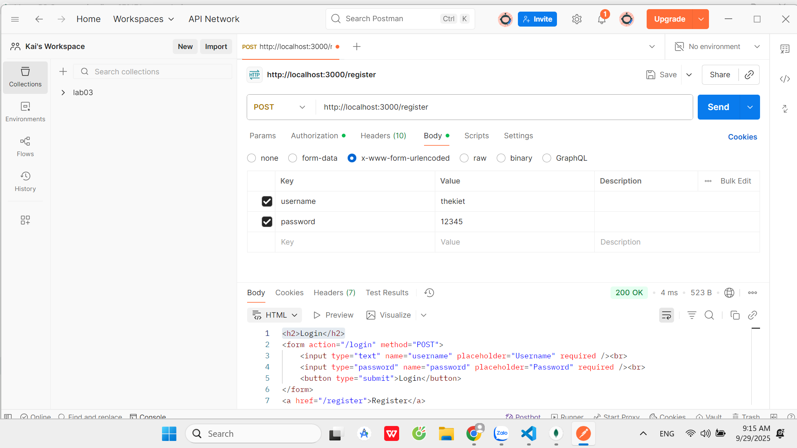
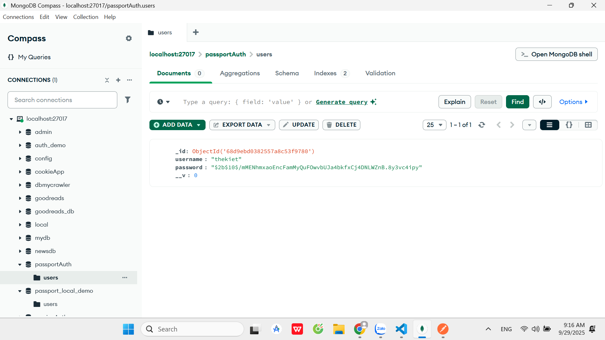
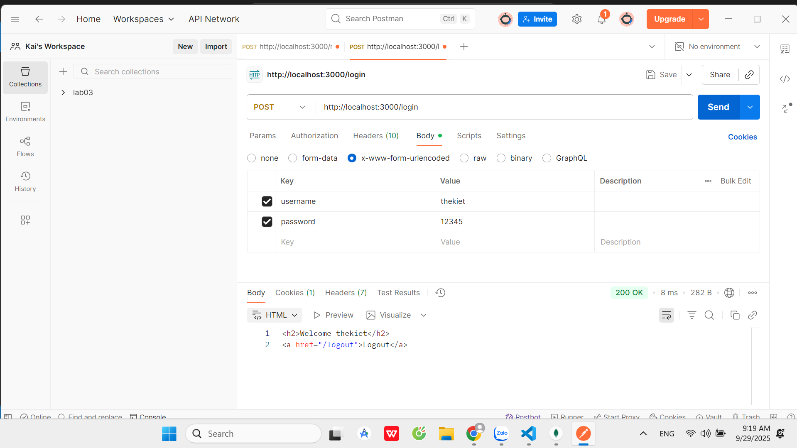
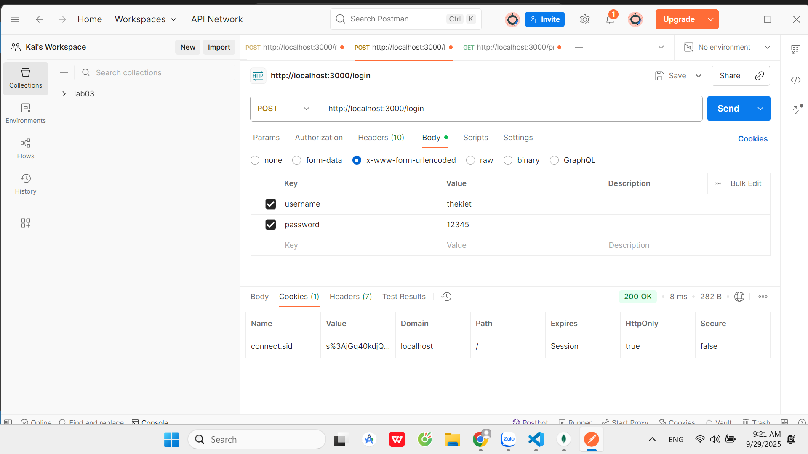
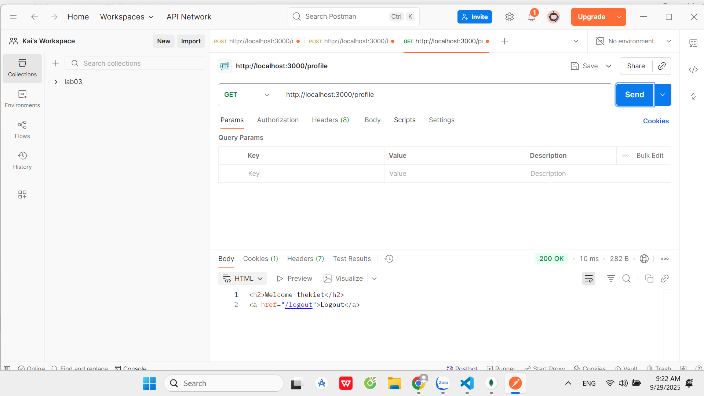
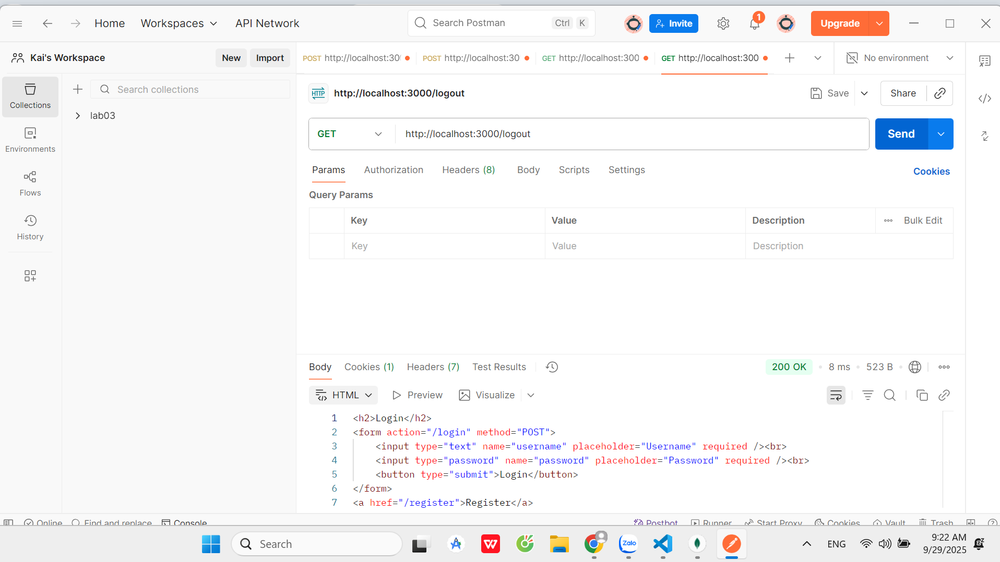
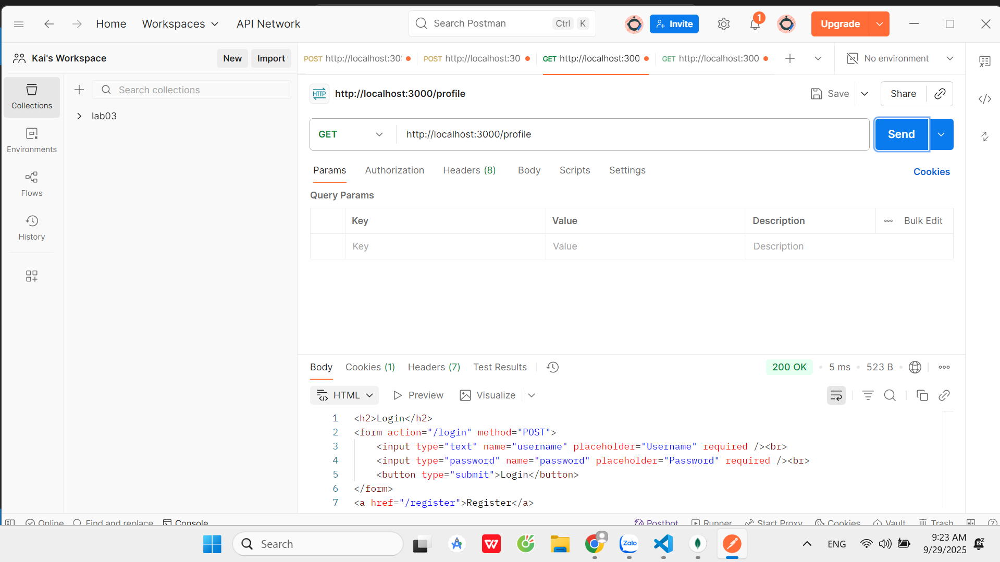

# Test local_passport_website

1. Register  
POST http://localhost:3000/register  
username: thekiet
password: 12345

2. Login  
POST http://localhost:3000/login  
username = thekiet
password = 12345

3. Profile (sau khi login)  
GET http://localhost:3000/profile  

4. Logout  
GET http://localhost:3000/logout  

5. Profile sau khi logout  
GET http://localhost:3000/profile  

